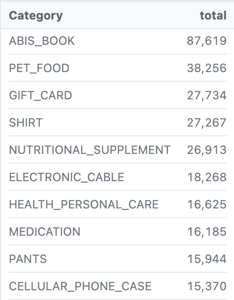
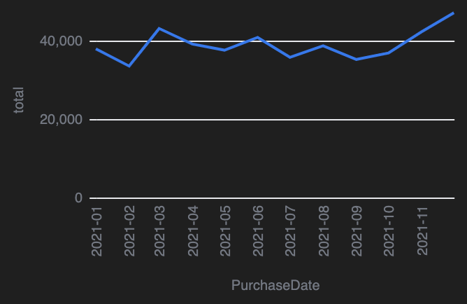
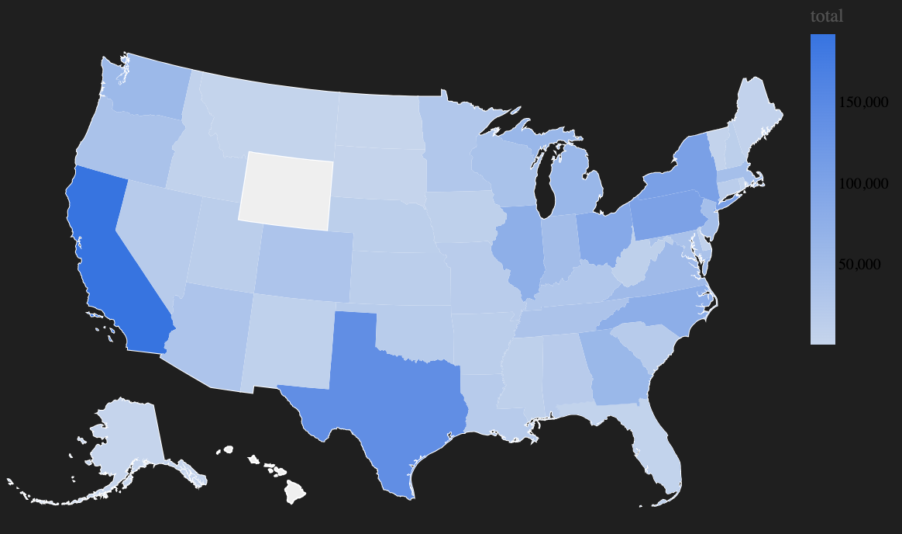

# Amazon Purchases and Consumer Survey Analysis
## Background 
This project analyzes a dataset related to Amazon purchase information and corresponding consumer survey responses. The data captures detailed insights into consumer behavior, including product categories, purchase frequency, customer demographics, and account use. Understanding these patterns can help businesses enhance customer experience, optimize product offerings, and improve marketing strategies.
## Motivation
The motivation for this analysis is to uncover trends and insights into consumer purchasing behavior on Amazon. By understanding which product categories are most popular, what drives customer satisfaction, and how demographics influence purchasing decisions, businesses can refine their strategies to better serve their target audience. This analysis aims to provide actionable insights for e-commerce businesses, marketers, and consumer behavior researchers.
## Code 
This repository contains one malloy file and three CSV files:
    - AmazonInformation.malloynb: Performs the analysis of Amazon purchase data and survey responses.
    - amazon-purchases.csv: Includes information on items purchased such as product category, title, price, date, and quantity.
    - survey.csv: includes information from the consumer survey such as age group, education level, household income, number of people on the account, etc. 
    - fields.csv: used to understand labels in the survey csv
## Summary of findings
Based on the analysis of the dataset, the following key findings were observed: 
### Popular product categories
 
Certain categories repeatedly showed up in my analysis as the most commonly purchased. These categories include ABIS_BOOK, PET_FOOD, GIFT_CARD, SHIRT, NUTRITIONAL_SUPPLEMENT, ELECTRONIC_CABLE, HEALTH_PERSONAL_CARE, MEDICATION, PANTS, and CELLULAR_PHONE_CASE. 
### Purchases over time
 
This analysis breaks down purchases first by year and then by month. Here, I found that amazon purchases were the highest in 2021, specifically increasing in the month of December. 
### Purchases by location

Using a shape map, I was able to create an image showing how purchase popularity was spread accross the United States. This information showed that most purchasees were based out of California and Texas. 
## Licensing 
The dataset analyzed in this project was sourced from publicly available consumer surveys and anonymized purchase records. Any additional files created as part of this analysis, including code and visualizations, are shared under the Apache License 2.0. This license applies to all files contained in this repository.
## Aknowledgements
This analysis was inspired by research into e-commerce consumer behavior and was conducted as part of an academic project at Gonzaga University. Special thanks to Professor Olsen for guidance in data analysis and interpretation. We also acknowledge the contributions of survey respondents and publicly available datasets that made this research possible.

